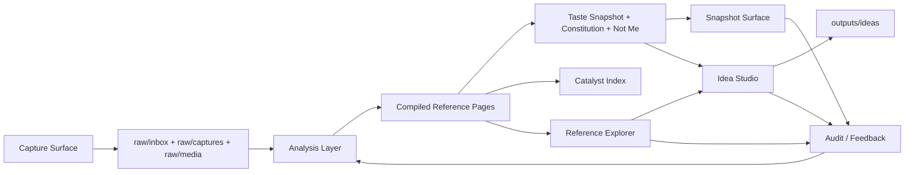

# Aftertaste Architecture

## Purpose

Aftertaste should be built as a **local-first taste engine for creators**.

The system is not a generic chat app and not a better bookmark manager. Its job is to:

- capture creative inputs quickly,
- compile them into a durable taste artifact,
- surface patterns across internal and external material,
- turn those patterns into creator-native outputs like hooks, scripts, and shot lists.

This document turns that idea into a concrete architecture for the current repo.

## Product Thesis

Aftertaste works when four layers stay separate:

1. **Raw source layer**: immutable captures, notes, metadata, uploads.
2. **Analysis layer**: structured signals extracted from each capture.
3. **Compiled taste layer**: wiki pages, reference summaries, snapshots, constitutions.
4. **Generation layer**: brief-driven outputs that cite the compiled taste layer.

That separation is the core defense against black-box AI behavior. The system stays inspectable because every generated output can be traced back to raw artifacts and compiled pages.

## Current Baseline In This Repo

The repo already has the right skeleton:

- capture creation and raw file writes in [web/server/aftertaste/service.ts](../../web/server/aftertaste/service.ts#L83)
- per-capture analysis in [web/server/aftertaste/service.ts](../../web/server/aftertaste/service.ts#L207)
- compilation into references, category pages, snapshots, style pages, and index in [web/server/aftertaste/service.ts](../../web/server/aftertaste/service.ts#L264)
- idea generation in [web/server/aftertaste/service.ts](../../web/server/aftertaste/service.ts#L318)
- current product routes in [web/server/routes/aftertaste.ts](../../web/server/routes/aftertaste.ts#L14)
- shared contracts in [web/shared/contracts.ts](../../web/shared/contracts.ts#L1)

So this architecture is not a reset. It is an extension of the current shape.

## Principles

- **Raw is immutable.** Once a capture is saved, it is never rewritten in place except for status and paths in its record.
- **Compilation is explicit.** The system should visibly move from capture -> analysis -> reference -> snapshot.
- **Voice is preserved, not overwritten.** Personal lines stay as placeholders when needed.
- **Every output cites references.** If the system cannot point to source references, it is guessing.
- **Internal and external signals share one graph.** Saved reels, notes, screenshots, and voice fragments must be queryable together.
- **Share-to-inbox first.** No architecture should depend on Instagram saved-post automation.
- **Use preprocessing before generation.** Compute the taste structure before the user asks for output.

## System Overview



## Workspace Layout

This matches the current `local-vault` shape and adds a few missing pieces deliberately.

```text
local-vault/
  CLAUDE.md
  log/
  audit/
  raw/
    inbox/
    captures/
    media/
  wiki/
    index.md
    references/
    themes/
    motifs/
    creators/
    formats/
    snapshots/
    style-constitution.md
    not-me.md
  outputs/
    app/
    ideas/
    catalysts/      # new
    briefs/         # new
```

### Directory Roles

- `raw/inbox/`: human-readable capture stubs.
- `raw/captures/`: canonical capture JSON records.
- `raw/media/<captureId>/`: uploaded assets, transcripts, OCR, future multimodal analysis.
- `wiki/references/`: generated pages per saved creative reference.
- `wiki/themes|motifs|creators|formats/`: compiled concept pages.
- `wiki/snapshots/`: current and historical taste snapshots.
- `outputs/app/`: JSON the app reads directly.
- `outputs/ideas/`: generated script/hook/shotlist outputs.
- `outputs/catalysts/`: precomputed thematic handles for retrieval and query expansion.
- `outputs/briefs/`: saved project briefs that connect work to taste memory.

## Data Model

The data model should stay file-backed and stable across implementation changes.

### 1. Raw Layer

| Entity | Source of truth | Purpose | Required fields |
|---|---|---|---|
| `CaptureRecord` | `raw/captures/<id>.json` | canonical saved-item record | `id`, `sourceUrl`, `platform`, `note`, `assets`, `ingestionMode`, `status`, `createdAt`, `updatedAt`, `rawPaths`, `metadata` |
| `CaptureAsset` | embedded in `CaptureRecord` | uploaded file metadata | `id`, `fileName`, `mediaType`, `kind`, `path`, `size` |
| `UrlMetadata` | embedded in `CaptureRecord` | fetched page metadata | `title`, `description`, `canonicalUrl`, `siteName`, `status`, `fetchedAt` |

### 2. Analysis Layer

| Entity | Source of truth | Purpose | Required fields |
|---|---|---|---|
| `AnalysisResult` | `raw/media/<id>/analysis.json` | structured understanding of one capture | `captureId`, `mode`, `caption`, `transcript`, `ocr`, `themes`, `motifs`, `creatorSignals`, `formatSignals`, `summary`, `confidence`, `assetInsights`, `generatedAt` |
| `CatalystRecord` | `outputs/catalysts/<slug>.json` | precomputed taste handles for retrieval | `id`, `label`, `kind`, `summary`, `queryHandles`, `referenceIds`, `relatedIds`, `updatedAt` |

### 3. Compiled Layer

| Entity | Source of truth | Purpose | Required fields |
|---|---|---|---|
| `ReferenceSummary` | `outputs/app/references.json` and `wiki/references/<id>.md` | compact compiled memory for a single reference | `id`, `title`, `platform`, `sourceUrl`, `note`, `pagePath`, `summary`, `themes`, `motifs`, `creatorSignals`, `formatSignals` |
| `TasteSnapshot` | `outputs/app/snapshot-current.json` and `wiki/snapshots/current.md` | current taste read | `id`, `window`, `summary`, `themes`, `motifs`, `creatorPatterns`, `notableReferences`, `promptSeeds`, `generatedAt` |
| `StyleConstitution` | `wiki/style-constitution.md` | slow-changing style truths | markdown page with frontmatter and cited claims |
| `NotMe` | `wiki/not-me.md` | anti-taste memory | markdown page with short, high-confidence exclusions |

### 4. Generation Layer

| Entity | Source of truth | Purpose | Required fields |
|---|---|---|---|
| `ProjectBrief` | `outputs/briefs/<id>.json` and optionally `wiki/projects/<slug>.md` | ties a creative task to references and constraints | `id`, `title`, `mode`, `deliverableType`, `goal`, `audience`, `constraints`, `selectedReferenceIds`, `voiceGuardrails`, `createdAt` |
| `IdeaRequest` | request payload and saved output | asks the system for a creative output | `snapshotId`, `referenceIds`, `outputType`, `brief` |
| `IdeaDraft` | embedded in `IdeaResponse` | one generated option | `id`, `title`, `body`, `citations`, `rationale`, `outputType`, `personalMoments` |
| `IdeaResponse` | `outputs/ideas/*.json` | saved generation result | `request`, `snapshot`, `outputs`, `generatedAt` |

## Proposed Extensions To The Current Contracts

The current contracts are good enough for v1. These additions make the model stronger without changing its shape.

### `CaptureRecord`

Add:

- `savedReason: string | null`
- `collection: string | null`
- `projectIds: string[]`
- `sourceKind: "reference" | "journal" | "brief" | "voice-note" | "moodboard"`

### `AnalysisResult`

Add:

- `toneSignals: SignalTag[]`
- `visualSignals: SignalTag[]`
- `audioSignals: SignalTag[]`
- `pacingSignals: SignalTag[]`
- `storySignals: SignalTag[]`
- `openQuestions: string[]`
- `moments: Array<{ label: string; description: string; assetId?: string }>`

### `ReferenceSummary`

Add:

- `relatedReferenceIds: string[]`
- `bestUseCases: string[]`
- `doNotCopy: string[]`
- `emotionalTone: string[]`
- `thumbnailAssetId: string | null`

### `TasteSnapshot`

Add:

- `tensions: Array<{ label: string; summary: string; referenceIds: string[] }>`
- `underexploredDirections: string[]`
- `antiSignals: string[]`
- `activeProjects: string[]`

## Pipeline

The pipeline should remain deterministic in shape even as the analysis gets smarter.

### Step 1: Capture

**User action**

- share a link,
- add a note,
- optionally upload screenshots, clips, or audio.

**Writes**

- `raw/inbox/<id>.md`
- `raw/captures/<id>.json`
- `raw/media/<id>/*`

**Current implementation**

- `POST /api/captures`
- `createCapture()`

**Next additions**

- support `sourceKind`
- support `collection`
- support multiple notes per capture

### Step 2: Normalize Metadata

**System action**

- fetch title/description/canonical URL,
- infer platform,
- classify asset types,
- preserve relative paths.

**Output**

- updated `CaptureRecord.metadata`

**Current implementation**

- inside `createCapture()`

**Keep**

- metadata fetch failure must never block capture success

### Step 3: Analyze Capture

**System action**

- combine source URL, note, metadata, handles, asset labels,
- extract tags and summary,
- infer themes, motifs, creators, formats,
- later: infer tone, pacing, visual grammar, and scene-level moments.

**Writes**

- `raw/media/<id>/analysis.json`
- capture status -> `analyzed`

**Current implementation**

- `runAnalysis()`
- deterministic rules over text and assets

**Target implementation**

Keep the same output contract, but replace the internals with a hybrid analyzer:

- rule-based extraction for stability
- LLM summarization for nuance
- vision/audio analysis when media exists

This lets the architecture evolve without rewriting downstream consumers.

### Step 4: Compile Taste Memory

**System action**

- convert analyzed captures into `ReferenceSummary`
- write `wiki/references/<id>.md`
- rebuild theme, motif, creator, and format pages
- rebuild `style-constitution.md`
- rebuild `not-me.md`
- rebuild `wiki/index.md`

**Writes**

- `outputs/app/references.json`
- `wiki/references/*.md`
- `wiki/themes/*.md`
- `wiki/motifs/*.md`
- `wiki/creators/*.md`
- `wiki/formats/*.md`

**Current implementation**

- `compileAftertaste()`

**Target implementation**

Split compile into two passes:

1. `compileReferences()` for per-item pages
2. `compileAggregates()` for cross-reference pages and constitution

That makes incremental rebuilds easier later.

### Step 5: Build Snapshot And Catalysts

**System action**

- summarize the current window,
- identify dominant themes/motifs,
- generate creator patterns,
- pick notable references,
- generate prompt seeds,
- build catalyst handles for future retrieval and query expansion.

**Writes**

- `outputs/app/snapshot-current.json`
- `wiki/snapshots/current.md`
- `wiki/snapshots/<window>.md`
- `outputs/catalysts/*.json`

**Current implementation**

- snapshot exists
- catalyst layer does not exist yet

**Target implementation**

Catalysts should be built from:

- themes,
- motifs,
- creator handles,
- tensions,
- repeated emotional/visual combinations

Example catalyst labels:

- `confession-through-observational-b-roll`
- `soft-pacing-with-private-voice`
- `identity-through-routine`
- `tenderness-with-close-up-framing`

### Step 6: Generate Creator Outputs

**System action**

- take a brief,
- expand it into multiple retrieval angles,
- fetch snapshot context and selected references,
- generate 1-3 outputs,
- leave personal beats as placeholders where needed.

**Writes**

- `outputs/ideas/*.json`

**Current implementation**

- `generateIdeas()`
- output types: `hooks`, `script`, `shotlist`

**Target implementation**

The generation stack should:

- always cite references by id,
- use `ProjectBrief` when present,
- consult `not-me.md` as a negative filter,
- consult `style-constitution.md` as a positive filter,
- separate structural writing from personal line-writing

### Step 7: Audit And Correction

**System action**

- let the user flag wrong references, wrong summaries, wrong motifs, or wrong conclusions,
- save precise feedback,
- rerun analysis or compile for the affected pages only.

**Writes**

- `audit/*.md`
- `audit/resolved/*.md`
- follow-up compile output

**Current implementation**

- audit infrastructure already exists in the repo

**Target implementation**

Every product surface should expose an audit affordance:

- `wrong theme`
- `not my style`
- `good reference, wrong reason`
- `hallucinated connection`

## First 3 Agent/Product Surfaces

These are the first three surfaces worth building fully. They align with the current app structure and the real creator job-to-be-done.

### Surface 1: Taste Snapshot

**User question**

- What am I circling right now?

**Primary inputs**

- latest compiled references
- snapshot window
- current constitution
- catalysts

**Agent role**

- synthesize dominant themes and motifs
- identify tensions and repeated combinations
- suggest prompt seeds
- point at what is underexplored

**Primary UI**

- summary block
- dominant themes/motifs
- notable references
- tensions
- prompt seeds

**Primary files and APIs**

- `outputs/app/snapshot-current.json`
- `wiki/snapshots/current.md`
- `GET /api/snapshot/current`

**What makes it valuable**

- it gives the user a live taste read instead of a pile of saved items

**V1 success condition**

- user can read one screen and immediately say "yes, that is what I have been into"

### Surface 2: Reference Explorer

**User question**

- Why did I save this, what does it connect to, and how could I use it?

**Primary inputs**

- `ReferenceSummary`
- related references
- category pages
- original raw capture and assets

**Agent role**

- explain the reference in taste terms
- connect it to motifs, themes, creators, and formats
- show related references and "not me" conflicts
- suggest best use cases without over-directing

**Primary UI**

- reference card or detail panel
- source preview
- why-it-matters explanation
- related references rail
- best use cases
- do-not-copy warnings

**Primary files and APIs**

- `wiki/references/<id>.md`
- `outputs/app/references.json`
- `GET /api/references`
- `GET /api/captures/:id`

**New API worth adding**

- `GET /api/references/:id/related`

**What makes it valuable**

- it converts a saved link from static storage into active creative memory

**V1 success condition**

- from one saved reel, the user can reach three useful related memories and understand the connection

### Surface 3: Idea Studio

**User question**

- Turn my taste into something I can actually make next.

**Primary inputs**

- `IdeaRequest`
- selected references
- current snapshot
- optional `ProjectBrief`
- constitution and not-me pages

**Agent role**

- expand the brief into retrieval angles
- pull the right references
- produce 1-3 options only
- preserve voice
- leave personal lines as placeholders

**Primary UI**

- brief input
- reference selector
- output type tabs: hooks, script, shot list
- citations
- personal moment placeholders
- rationale panel

**Primary files and APIs**

- `outputs/ideas/*.json`
- `POST /api/ideas`

**New APIs worth adding**

- `POST /api/briefs`
- `GET /api/briefs/:id`

**What makes it valuable**

- it closes the loop from saved taste -> usable creative output

**V1 success condition**

- a creator can generate a script structure they would actually keep working on

## Agent Roles Behind The Surfaces

These roles should remain explicit even if they run in one process.

### Capture Agent

- owns raw ingest
- never edits compiled pages directly
- writes capture and asset artifacts

### Analysis Agent

- owns `AnalysisResult`
- extracts signals and moments
- does not generate user-facing creative outputs

### Compile Agent

- owns wiki pages, snapshot, constitution, not-me, and catalysts
- updates cross-reference pages conservatively

### Idea Agent

- owns hooks, scripts, shot lists, and brief transformations
- must cite references
- must obey voice guardrails

### Audit Agent

- applies corrections and targeted recompiles
- never silently changes meaning without an audit trail

## Implementation Order

### Phase 1: Stabilize The Contracts

- keep the current route shape
- add `sourceKind`, `ProjectBrief`, and `CatalystRecord`
- keep outputs file-backed

### Phase 2: Add Catalyst Build

- compute prebuilt thematic handles from compiled references
- store them in `outputs/catalysts/`
- use them for related-reference lookup and multi-angle idea generation

### Phase 3: Strengthen Reference Explorer

- add related references
- add best use cases
- add do-not-copy warnings
- expose an audit action per reference

### Phase 4: Strengthen Idea Studio

- make idea generation consume `ProjectBrief`
- read constitution and not-me pages on every generation
- enforce 1-3 output variants
- preserve personal placeholders

### Phase 5: Upgrade Analysis Internals

- keep the same contracts
- swap deterministic-only analysis for hybrid LLM/media analysis
- add tone, pacing, and visual grammar

## What Not To Build First

- full Instagram saved-item sync
- multi-user shared taste graphs
- a generic chatbox over the vault
- fully autonomous content generation without citations
- a giant vector stack before the compiled memory layer is strong

## Immediate Next Technical Moves

If this architecture becomes the working spec, the next code changes should be:

1. add `CatalystRecord` and `ProjectBrief` to [web/shared/contracts.ts](../../web/shared/contracts.ts#L1)
2. split `compileAftertaste()` into reference compile + aggregate compile in [web/server/aftertaste/service.ts](../../web/server/aftertaste/service.ts#L264)
3. add `outputs/catalysts/` generation and a related-reference API
4. update the ideas pipeline so it reads constitution + not-me + catalysts before output generation

## Bottom Line

Aftertaste should not be architected as "AI over saved links." It should be architected as:

- capture,
- analyze,
- compile,
- snapshot,
- generate,
- audit.

That sequence turns scattered inspiration into a durable taste memory and then turns that memory into creator-native outputs.

The first three surfaces to make excellent are:

1. `Taste Snapshot`
2. `Reference Explorer`
3. `Idea Studio`

If those three work, the product will feel coherent. Everything else can layer on top.
